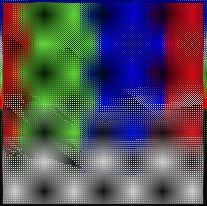
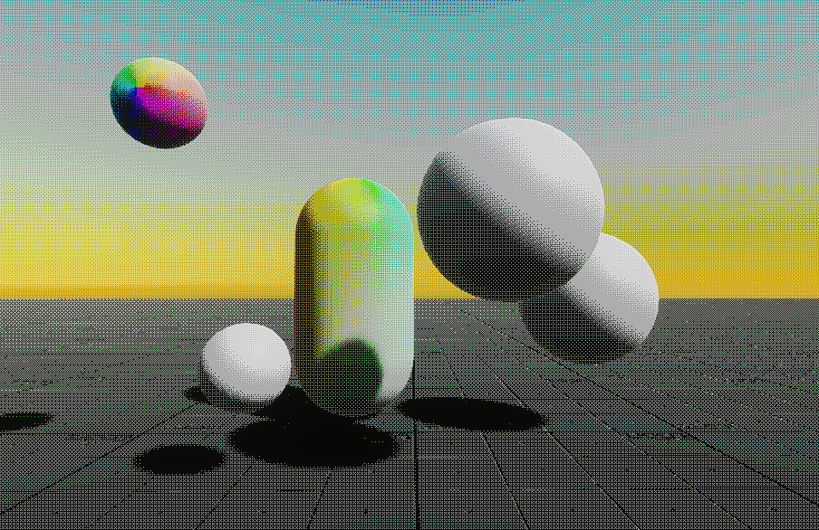
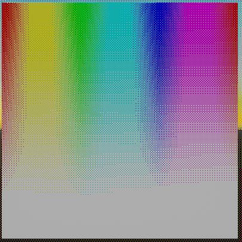

# Colorspace Dither
When making a dither shader, many people just dither the individual RGB channels. This results in a decent effect, but doesn't replicate the old-school color palettes. You could index the palette and get the closest color to the palette color, but that's a bit much.

Instead, I switch the RGB values to other colorspaces first, dither using those values, and then convert back. These dithers create a palette that looks much closer to the old-school palettes of pixel artists. By converting to HSV, you can have separate numbers of dither layers for hue versus saturation and value, giving three bands of color and just one band of saturation and brightness.

## Preview
Here's 3 bands of hue, one of saturation, and one value:




And here's two bands of R, G, and B:




As you can see, using 3 bands of hue with only one band of both saturation and value gives much more distinct colors, and adding more bands gives more base colors, instead of increasing the diversity of all the colors (which eventually just becomes a blob of true RGB values). I've also implemented OKLab as a third option. 

## Setup

The code I'm using to convert between colorspaces is not free, so it has not been included, but this is the structure of my colorspace.cginc:

```hlsl
#pragma once

float3 RGBtoHSV(float3 color)
float3 HSVtoRGB(float3 color)

float3 linear_srgb_to_oklab(float3 c)
float3 oklab_to_linear_srgb(float3 c)
```

The RGBtoHSV conversions are taken right from [Unity's ShaderGraph docs](https://docs.unity3d.com/Packages/com.unity.shadergraph@6.9/manual/Colorspace-Conversion-Node.html), and OKLab has theirs posted on [their github](https://bottosson.github.io/posts/oklab/).